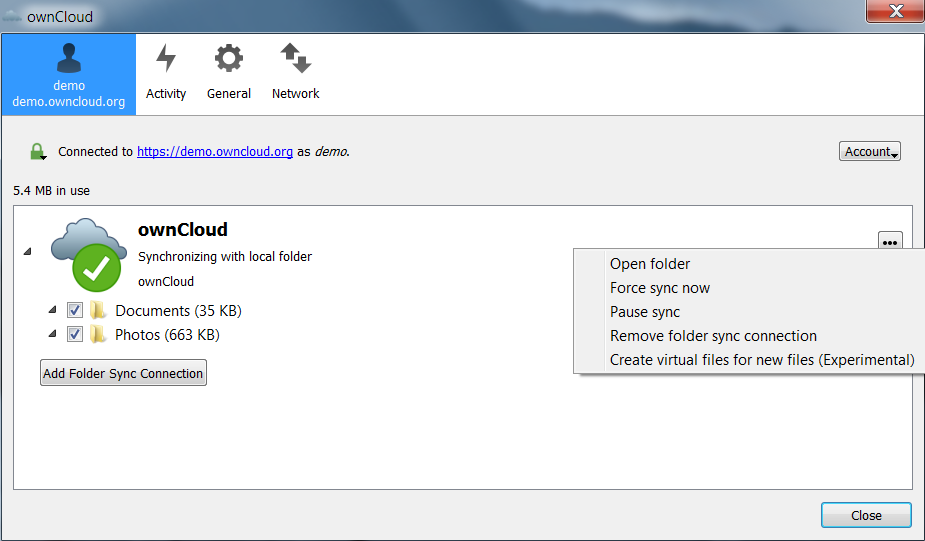
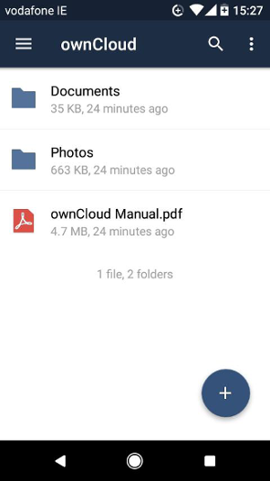

# ownCloud quickstart (work in progress)

ownCloud is client/server software for file syncing and sharing. ownCloud enables you to manage data on your own private cloud server, and share with 
multiple client users and devices in a safe and secure way. 

ownCloud is available in the following installation options: 

| Component      | Installation Option | 
| -------------- | ------------------- |
| Server         | Linux, Docker, virtual appliance, or hosted service |
| Desktop client | MacOS, Windows, or Linux | 
| Mobile app     | iOS or Android | 

This quickstart explains how administrators can install the open source ownCloud server (Community Edition), and how users can connect 
to an ownCloud server from different client devices. 

## Install and configure your ownCloud server
The free and open source ownCloud server manages your files and data and controls user access. 

### Before you begin

You must ensure that your web server host has the following software installed:
- Linux or Docker 
- Apache web server
- Database (for example, MySQL or SQLite)
- PHP runtime

For details on recommended versions, see <a href="https://doc.owncloud.org/server/10.0/admin_manual/installation/system_requirements.html#officially-recommended-supported-options" target="_blank">System Requirements</a>.
For guidelines on deploying ownCloud in an open source LAMP stack, see <a href="https://doc.owncloud.org/server/10.0/admin_manual/installation/deployment_recommendations.html" target="_blank">Deployment Recommendations</a>. 

### Install the ownCloud server
  1. Ensure that all the required packages have been installed for your system:
   - <a href="https://doc.owncloud.org/server/10.0/admin_manual/installation/source_installation.html#prerequisites-label" target="_blank">Prerequisites</a>
   - <a href="https://doc.owncloud.org/server/10.0/admin_manual/installation/source_installation.html#install-the-required-packages" target="_blank">Install the Required Packages</a>
  2. Download the `.tar` or `.zip` archive for the latest ownCloud server from: <a href="https://owncloud.org/download" target="_blank">https://owncloud.org/download</a>.
  3. Extract the archive contents on your host. For example:
```
tar -xjf owncloud-x.y.z.tar.bz2
unzip owncloud-x.y.z.zip
```   
  4. Copy the `owncloud` directory to the Apache root directory. For example:
```
cp -r owncloud /var/www
``` 
     
### Configure your Apache web server
  1. Create the following file: 
```
/etc/apache2/sites-available/owncloud.conf
```
  2. Add the following content: 
````  
    Alias /owncloud "/var/www/owncloud/"
         <Directory /var/www/owncloud/>
          Options +FollowSymlinks
          AllowOverride All
          <IfModule mod_dav.c>
          Dav off
          </IfModule>
          SetEnv HOME /var/www/owncloud
          SetEnv HTTP_HOME /var/www/owncloud
         </Directory>     
````	 
  3. Create the following symlink:
```
ln -s /etc/apache2/sites-available/owncloud.conf
 /etc/apache2/sites-enabled/owncloud.conf
```
  4. Restart your Apache web server when finished your configuration. For example:
```  
sudo service apache2 restart 
```    
For more details, see: 
 - <a href="https://doc.owncloud.org/server/10.0/admin_manual/installation/source_installation.html#apache-configuration-label" target="_blank">Additional Apache Configurations</a>
 - <a href="https://doc.owncloud.org/server/10.0/admin_manual/installation/source_installation.html#enable-ssl" target="_blank">Enable SSL</a>

 
### Run the ownCloud installation wizard or command
After restarting Apache, you must complete your installation by running the ownCloud graphical installation wizard or using the `occ` command. 

To run the graphical installation wizard:
 1. Enter the following URL in your browser: <a href="http://localhost/owncloud" target="_blank">http://localhost/owncloud</a>. 
 2. To create an admin account, enter the username and password you wish to use.
 2. Click **Finish setup**.
 
For details on database options and post-installation steps, 
see <a href="https://doc.owncloud.org/server/10.0/admin_manual/installation/installation_wizard.html" target="_blank">The Installation Wizard</a>. 

Alternatively, you can use the `occ` command to install on the command line or in scripts (see 
see <a href="https://doc.owncloud.org/server/10.0/admin_manual/installation/command_line_installation.html" target="_blank">Command Line Installation</a>).


### Enable users to connect to the ownCloud server on a custom port
By default, users connect to the ownCloud server IP address using the default port (`80`). You can use a custom port (`8080`) by editing your Apache 
web server configuration:
  1. Edit the following file:
```
/etc/apache2/ports.conf
```  
  2. Change the first line to:  
```
Listen 8080
```
  3. Edit the following file:
```
/etc/apache2/sites-enabled/000-default.conf
```  
  4. Change the first line to:  
```
    <VirtualHost *: 8080>
```
  5. Restart your Apache web server. For example:
```  
sudo service apache2 restart 
```    
  6. Test the connection in your browser. For example: 
```  
http://192.0.2.4:8080
```    
  
For more details, see your Apache HTTP Server documentation.  


### Add a user account
When logged in as administrator, you can add new user accounts on the **User management** page in the ownCloud web UI:
  1. Enter the user name and initial password.
  2. Add group memberships for the user (optional).
  3. Click **Create** to add the new account.
  
_**Note**: To enable automatic notification email, you must select **Send email to new user** in the control panel in the left sidebar before you can enter the user email address._  
  
For more details, see <a href="https://doc.owncloud.org/server/10.0/admin_manual/configuration/user/user_configuration.html" target="_blank">User management</a>.  


## Connect to an ownCloud server from a client device
Users can connect to an ownCloud server from multiple client devices (for example, desktop client, browser, or mobile app). 

### Connect to an ownCloud server on a desktop client
  1. Download the free client software for your platform from <a href="https://owncloud.org/download" target="_blank">https://owncloud.org/download</a>.
  2. Run the **ownCloud Setup** wizard to install.
  3. Enter the **Server Address** URL (for example, <a href="https://demo.owncloud.org" target="_blank">https://demo.owncloud.org</a>), and click **Next**.
  4. Enter your username/password (in this case, **demo**/**demo**), and click **Next**.
  5. Click **Connect** and wait for a few seconds for your files to sync.
  6. Click the ellipsis button on the right to manage your files (for example, select **Open folder**, create a new **Music** folder, and select **Force sync now**).

  
  
Alternatively, on your desktop, you can also open a browser, and connect to an ownCloud server URL address. 

### Connect to an ownCloud server on a mobile app client
  1. Download the app from the Google Play Store or Apple App Store.
  2. Open the app, and enter your server URL address (for example, <a href="https://demo.owncloud.org" target="_blank">https://demo.owncloud.org</a>)
  3. Enter your username/password (in this case, **demo**/**demo**).
  4. View the data available on the server (for example, **Photos** or **Documents**)
  5. Click **+** to upload a photo or file.  

    
  
For details on supported client versions, 
see <a href="https://doc.owncloud.org/server/10.0/admin_manual/installation/system_requirements.html#officially-recommended-supported-options" target="_blank">System Requirements</a>.

 